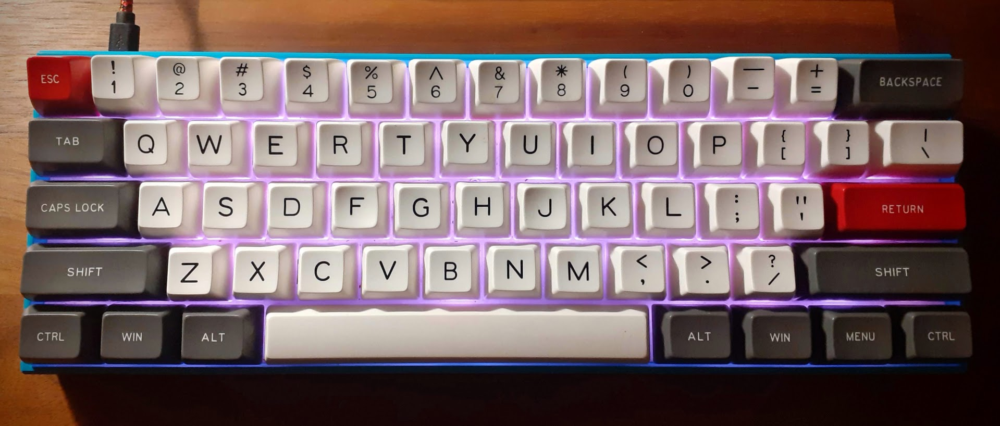

# Trogels Anne Pro QMK firmware

This is my personal keyboard configuration based on the https://github.com/msvisser/qmk_firmware/tree/anne_pro/keyboards/anne_pro



The keyboard is an Anne Pro (gen.1) with Gateron blue switches (clikkey clikkey) and a SA profile keycaps set (https://kbdfans.com/products/in-stockmaxkey-foundation-sa-keycaps-set) 

The keyboard firmware is modded to my personal liking. Feel free to get inspired :)


## Base layer

The baselayer follows pretty much standard ANSI 60% layout with a few modifications.

### Double tap modifiers
- `ESC` will act as `GRAVE`
- `LCTRL` will act as `MOUSEBTN4` (navigate back)
- `RCTRL` will act as `MOUSEBTN5`(navigate forward)

### Function Keys 
- `RWIN` activate 1st layer (Navigation)
- `MENU` activate 2nd layer (Recordable macro)
 
## 1st layer

From the base layer following is available:
 
 - `W`,`A`,`S`,`D` acts as arrow keys.
 - `J`,`K`,`L` volume control
 - `[`,`]` as `HOME`/`END`
 - `BACKSPACE` as `DELETE`
 - `B` access 3rd layer (Bluetooth connection)
 - `;`,`'` for `PGUP`/`PGDN`
 - Tap `TAB` access 4th layer
 
## 2nd layer (Recordable macros)
 
- `R` for START RECORD
- `S` for STOP RECORD
- `P` for PLAY

## 3rd layer (Bluetooth connection)
  
## 4th layer (macros)
- `Q` public sshkey
- `W` my email
- `E` MACRO3
- `D` MACRO4


## Flash the keyboard

To build and flash firmware you need to checkout  https://github.com/msvisser/qmk_firmware/
and navigate to `keyboards/anne_pro/keymaps/` and checkout this repository as `custom` So that this readme file is located `keyboards/anne_pro/keymaps/custom/readme.md`. There's a few modifications to the anne_pro firmware to get the extra features to work.

keyboards/anne_pro/anne_pro.c:175 
```cpp
    anne_pro_lighting_mode(APL_MODE_PINK);
```
keyboards/anne_pro/config.h 
```cpp
    #define TAPPING_TERM 200
```

keyboards/anne_pro/rules.mk
```cpp
MOUSEKEY_ENABLE = yes
DYNAMIC_MACRO_ENABLE = yes
TAP_DANCE_ENABLE = yes
```

After these modifications simply run `make anne_pro:custom:dfu-util` with the keyboard set in DFU mode.